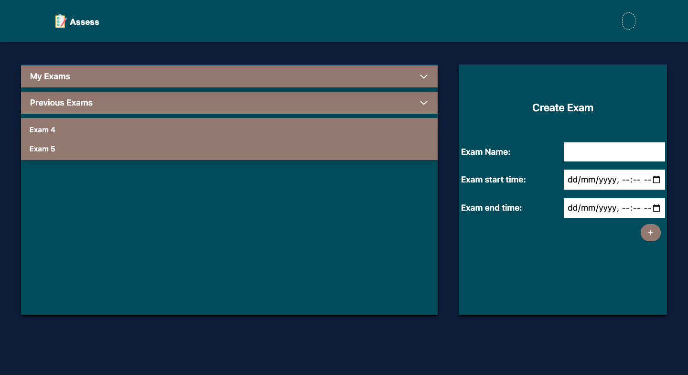

# Subjective Answers Evaluation Using Machine Learning

A web-based platform that automates the evaluation of subjective (long-form) answers using advanced machine learning and natural language processing techniques. Designed to reduce manual grading workload, improve consistency, and provide timely feedback to students and educators.

---

## Introduction

Manual evaluation of subjective answers is time-consuming, labor-intensive, and prone to human bias. This project leverages machine learning and NLP to automate the grading of descriptive answers, providing a scalable and objective solution for educational institutions.

---

## Problem Statement

The current education system relies heavily on manual grading of subjective answers, leading to delays in feedback and inconsistencies in evaluation. Existing automated tools primarily handle objective questions (like MCQs) and do not address the complexities of essay or short-answer grading.

---

## Objectives

- **Automated Evaluation:** Accurately assess subjective responses using machine learning and NLP.
- **Faculty Platform:** Enable teachers to create, schedule, and analyze exams.
- **Student Portal:** Allow students to register, attempt exams, and review scores.
- **Reduce Bias:** Minimize manual workload and human error in grading.
- **Scalable Solution:** Support a wide range of subjects and question types.

---

## System Overview

The platform consists of three main components:

- **Teacher Module:**
    - Create and schedule exams
    - Provide model answers
    - Analyze student performance
- **Student Module:**
    - Register and attempt exams
    - View results (if permitted)
- **Evaluation Model:**
    - Compares student answers with model answers
    - Uses NLP techniques (embedding, similarity metrics, etc.)
    - Outputs a normalized score (0 to 1) for each answer

---

## Key Features

- Secure authentication for students and teachers
- Web-based interface for exam creation and participation
- Automated semantic evaluation of answers using ML/NLP
- Real-time scoring and analytics for educators
- Scalable backend for handling multiple exams and users

---

## User Login


## Faculty Manage Exams



## Faculty Create Exam


---

## Literature Survey

- **Neethu George et al. (2019):** Used NLP preprocessing and LSTM-RNN for answer grading; highlighted the challenge of building domain-specific datasets.
- **Jain \& Lobiyal:** Proposed concept graphs for subjective answer evaluation using graph similarity.
- **Montes et al.:** Explored information retrieval with conceptual graph matching.
- **Kusner et al.:** Introduced Word Mover’s Distance (WMD) for measuring text dissimilarity using word embeddings, improving classification efficiency and accuracy.

---

## Project Structure

```
Subjective_Answer_Evaluation/
├── backend/           # Server-side code (Python, ML models, API)
├── frontend/          # Client-side code (Web UI)
├── README.md
├── .gitignore
└── ...
```


---

## Installation \& Setup

1. **Clone the repository:**

```bash
git clone https://github.com/AayushPatel006/Subjective_Answer_Evaluation.git
cd Subjective_Answer_Evaluation
```

2. **Backend Setup:**
    - Ensure Python 3.8+ is installed.
    - Install required Python libraries:

```bash
pip install -r backend/requirements.txt
```

    - Set up any additional ML/NLP models as specified in the backend documentation.
3. **Frontend Setup:**
    - Follow instructions in the `frontend/` directory to install dependencies and run the web client.
4. **Run the Application:**
    - Start the backend server (see backend README or docs).
    - Start the frontend client.
    - Access the platform via your browser.

---

## Results

The system demonstrates effective automated grading of subjective answers, providing scores closely aligned with human evaluators. It enables teachers to manage exams efficiently and students to receive timely, unbiased feedback.

---

## Conclusion

This project addresses a critical gap in educational technology by automating the evaluation of subjective answers. By leveraging machine learning and NLP, it streamlines the grading process, reduces bias, and enhances the learning experience for both educators and students.

---

## Team

- **Aayush Patel** (2022601005)
- **Mursaleen Batatawala** (2022601001)
- **Omkar Bhoir** (2022601002)

**Project Guide:** Prof. Varsha Hole

Sardar Patel Institute of Technology, Department of Computer Engineering

---

## References

- Neethu George, Sijimol PJ, Surekha Mariam Varghese, "Grading descriptive answer scripts using deep learning," *International Journal of Innovative Technology and Exploring Engineering*, 2019.
- G. Jain and D. K. Lobiyal, "Conceptual graphs based approach for subjective answers evaluation," *International Journal of Conceptual Structures and Smart Applications*, 2017.
- M. Montes-y-Gómez, A. López-López, and A. Gelbukh, "Information retrieval with conceptual graph matching," *International Conference on Database and Expert Systems Applications*, 2000.
- M. Kusner, Y. Sun, N. Kolkin, and K. Weinberger, "From word embeddings to document distances," *International Conference on Machine Learning*, 2015.

---
